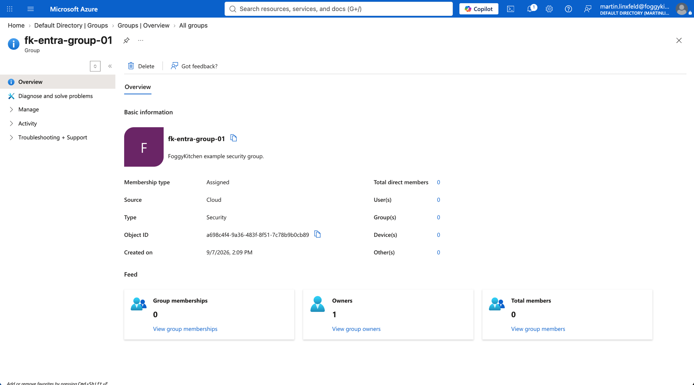
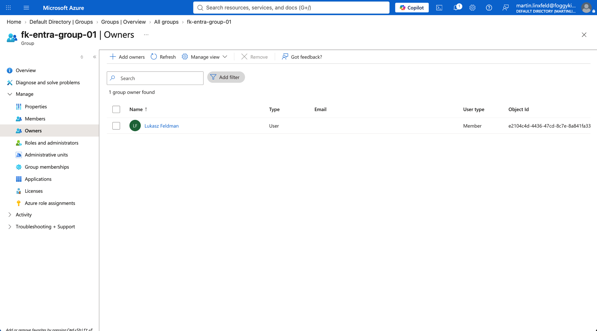

# Example 01: Microsoft Entra Security Group

In this Microsoft Entra example, we deploy a **security-enabled Microsoft Entra group** using **Terraform/OpenTofu** and the local `terraform-az-fk-entra-group` module.
The current AzureAD provider principal is automatically added as a group owner by the module default.

This example focuses on the **minimal group deployment path**, where only the group display name and optional description are supplied by the caller.

---

## Architecture Overview

This deployment creates:

- One **Microsoft Entra security group** using the local `terraform-az-fk-entra-group` module
- One group display name configured through `display_name`
- One optional group description configured through `description`
- The current AzureAD provider principal as an effective group owner

This is the most direct way to understand the base module contract before adding explicit owners, members, or downstream Azure service integrations.

---

## Configuration Layout

- **Example directory:** `examples/01_security_group`
- **Default display name:** `fk-entra-group-01`
- **Default description:** `FoggyKitchen example security group.`
- **Group type:** security-enabled Microsoft Entra group
- **Default owner behavior:** current AzureAD provider principal is included as owner

Microsoft Entra groups are tenant-level directory objects.
They are not deployed into an Azure Resource Group and do not support Azure resource tags.

---

## Deployment Steps

Change into the example directory:

```bash
cd examples/01_security_group
```

Copy the example variables file:

```bash
cp terraform.tfvars.example terraform.tfvars
```

Initialize and apply the Terraform/OpenTofu configuration:

```bash
tofu init
tofu plan
tofu apply
```

After a successful deployment, OpenTofu will output:

- The Microsoft Entra group resource ID
- The Microsoft Entra group object ID
- The Microsoft Entra group display name
- The Microsoft Entra tenant ID used by the AzureAD provider

---

## Runtime Notes

After deployment, the Microsoft Entra group should:

- be security-enabled
- have the configured display name
- have the configured description when `description` is set
- include the current AzureAD provider principal as an owner
- prevent duplicate display names by default

The identity running this example needs permission to create Microsoft Entra groups in the target tenant.

---

## Azure Console And Runtime Verification

### Microsoft Entra Group Overview

In the Azure portal, open Microsoft Entra ID and verify that the group exists with the expected display name and description.



### Group Ownership

Confirm that the current AzureAD provider principal appears in the group owners list.



### Terraform/OpenTofu Outputs

Confirm that `group_object_id`, `group_display_name`, and `tenant_id` match the group shown in Microsoft Entra ID.

---

## Cleanup

To remove all resources created by this example:

```bash
tofu destroy
```

---

## Summary

This example demonstrates:

- How to deploy a **Microsoft Entra security group** using Terraform/OpenTofu
- How to use the local `terraform-az-fk-entra-group` module with minimal required inputs
- How the current AzureAD provider principal is included as a group owner by default
- How to retrieve the group object ID for use by other modules or service configurations

---

## Learn More

Visit [FoggyKitchen.com](https://foggykitchen.com/) for Azure, OCI, multicloud, and Terraform/OpenTofu learning resources.

---

## License

Licensed under the **Universal Permissive License (UPL), Version 1.0**.
See [LICENSE](../../LICENSE) for more details.

---

© 2026 [FoggyKitchen.com](https://foggykitchen.com) - Cloud. Code. Clarity.
