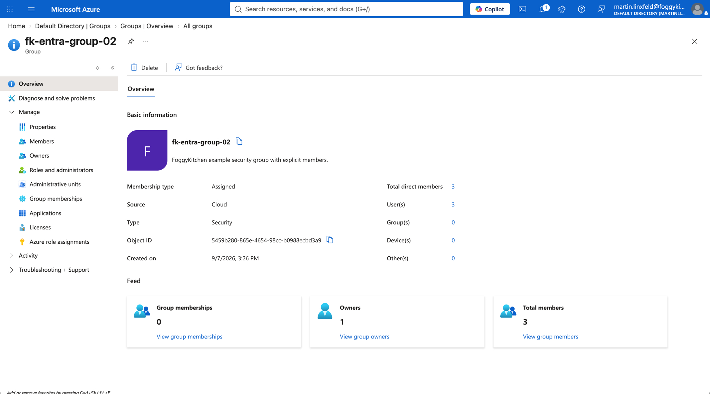
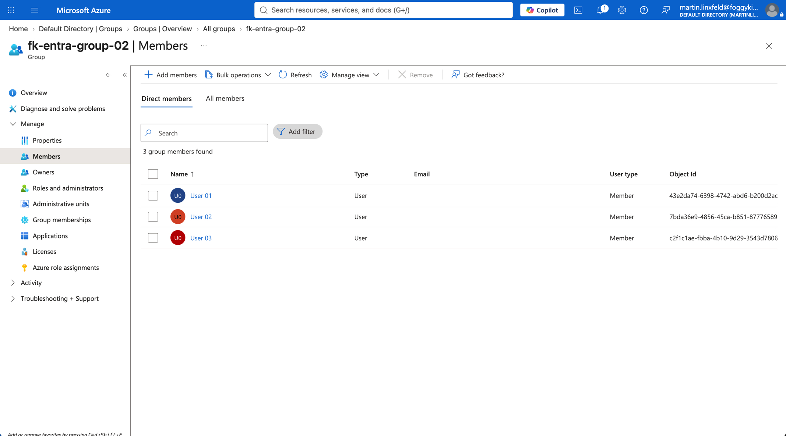

# Example 02: Microsoft Entra Group With Members

In this Microsoft Entra example, we deploy three **Microsoft Entra users** using the public `terraform-az-fk-entra-user` module, then deploy a **security-enabled Microsoft Entra group** using the local `terraform-az-fk-entra-group` module and attach those users as group members.
The group can then be passed to service modules that accept Microsoft Entra group principals for administration, authorization, or application access patterns.

This example focuses on the **group membership deployment path**, where user principals are created first and their object IDs are passed into the group membership configuration.

---

## Architecture Overview

This deployment creates:

- Three **Microsoft Entra users** using `terraform-az-fk-entra-user`
- One **Microsoft Entra security group** using the local `terraform-az-fk-entra-group` module
- One group display name configured through `display_name`
- One optional group description configured through `description`
- The current AzureAD provider principal as an effective group owner
- Explicit group members derived from the created user object IDs

This is the most direct way to understand how the Entra group module can compose with user principals while keeping the group object ID available for downstream Azure service integrations.

---

## Configuration Layout

- **Example directory:** `examples/02_group_with_members`
- **Default display name:** `fk-entra-group-02`
- **Default description:** `FoggyKitchen example security group with explicit members.`
- **Group type:** security-enabled Microsoft Entra group
- **Default users:** `user01`, `user02`, `user03`
- **UPN suffix input:** `user_principal_name_suffix`
- **Member source:** user object IDs created by `terraform-az-fk-entra-user`
- **Default owner behavior:** current AzureAD provider principal is included as owner

Microsoft Entra users and groups are tenant-level directory objects.
They are not deployed into an Azure Resource Group and do not support Azure resource tags.

---

## Deployment Steps

Change into the example directory:

```bash
cd examples/02_group_with_members
```

Copy the example variables file:

```bash
cp terraform.tfvars.example terraform.tfvars
```

Update `terraform.tfvars` with a real verified Microsoft Entra domain suffix and a suitable initial password:

```hcl
user_principal_name_suffix = "example.com"
member_password            = "ChangeMe-12345!"
```

Initialize and apply the Terraform/OpenTofu configuration:

```bash
tofu init
tofu plan
tofu apply
```

After a successful deployment, OpenTofu will output:

- The Microsoft Entra group resource ID
- The Microsoft Entra group object ID
- The Microsoft Entra group display name
- The effective member object IDs configured on the group
- The created user object IDs keyed by example user
- The created user principal names keyed by example user

---

## Runtime Notes

After deployment, the Microsoft Entra group should:

- be security-enabled
- have the configured display name
- have the configured description when `description` is set
- include the current AzureAD provider principal as an owner
- include `user01`, `user02`, and `user03` as members
- prevent duplicate display names by default

The identity running this example needs permission to create Microsoft Entra users, create Microsoft Entra groups, and manage group memberships in the target tenant.
Protect local state and plan files because user password material can be stored in Terraform/OpenTofu state.

---

## Azure Console And Runtime Verification

### Microsoft Entra Group Overview

In the Azure portal, open Microsoft Entra ID and verify that the group exists with the expected display name and description.



### Group Membership

Confirm that `user01`, `user02`, and `user03` appear in the group members list.



### Terraform/OpenTofu Outputs

Confirm that `group_object_id`, `group_display_name`, `member_object_ids`, `user_object_ids`, and `user_principal_names` match the users and group shown in Microsoft Entra ID.

---

## Cleanup

To remove all resources created by this example:

```bash
tofu destroy
```

---

## Summary

This example demonstrates:

- How to deploy a **Microsoft Entra security group** using Terraform/OpenTofu
- How to create Microsoft Entra users with `terraform-az-fk-entra-user`
- How to add created users as group members through the local `terraform-az-fk-entra-group` module
- How to retrieve the group object ID for use by other modules or service configurations

---

## Learn More

Visit [FoggyKitchen.com](https://foggykitchen.com/) for Azure, OCI, multicloud, and Terraform/OpenTofu learning resources.

---

## License

Licensed under the **Universal Permissive License (UPL), Version 1.0**.
See [LICENSE](../../LICENSE) for more details.

---

© 2026 [FoggyKitchen.com](https://foggykitchen.com) - Cloud. Code. Clarity.
